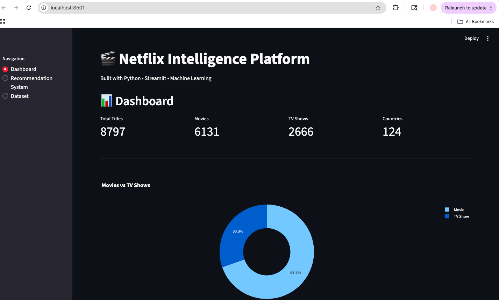
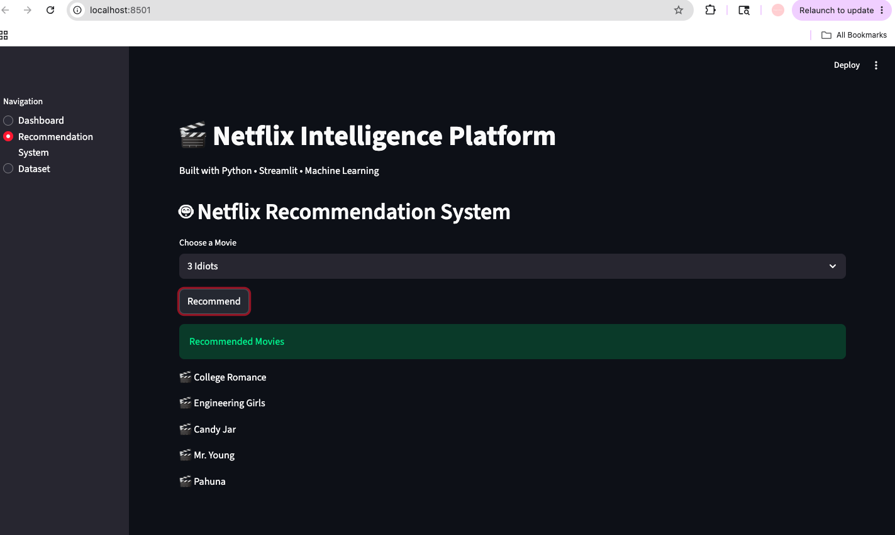
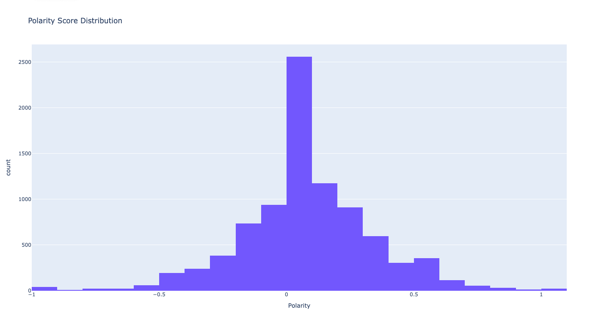
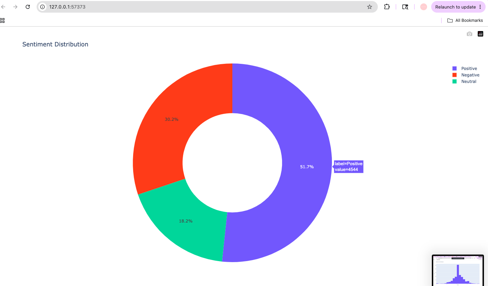
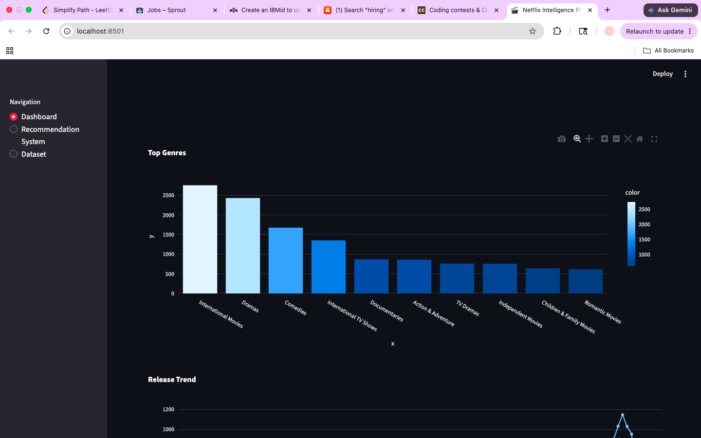
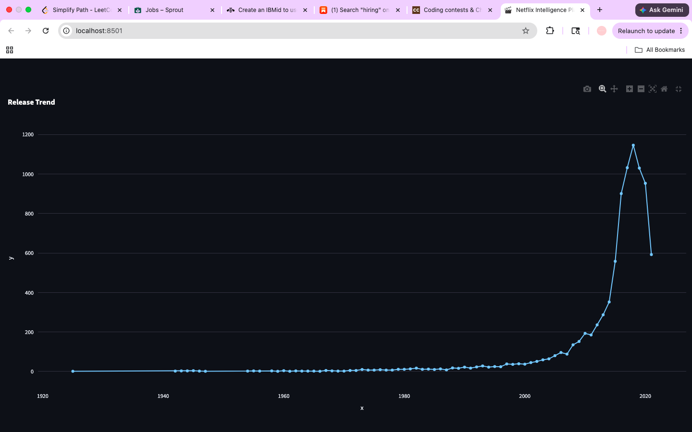
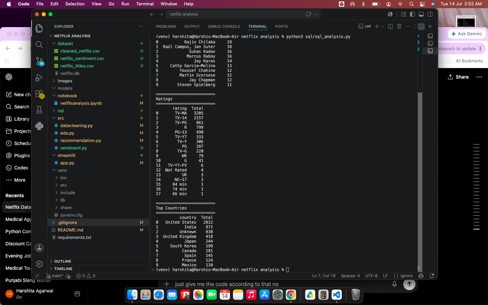
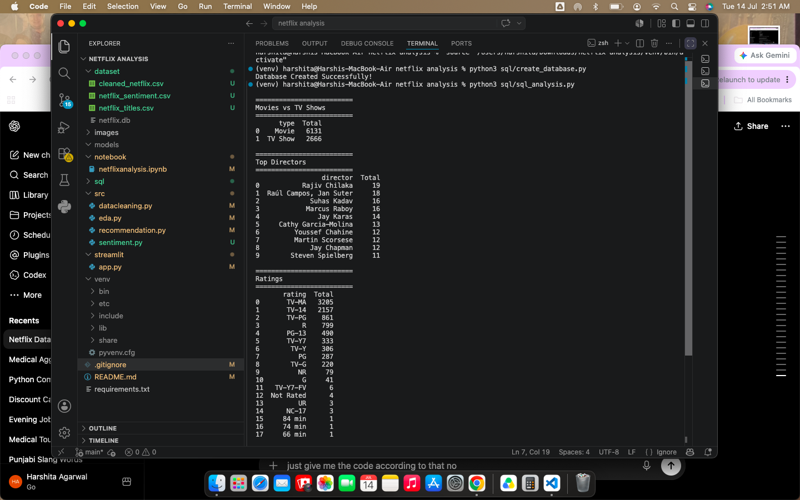

# 🎬 Netflix Intelligence Platform

## 📌 Project Overview

Netflix Intelligence Platform is an end-to-end Data Analytics and Machine Learning project developed using Python, SQL, Streamlit, Plotly, and Scikit-Learn.

The project analyzes Netflix's content library to discover trends, build dashboards, and recommend similar content using Natural Language Processing.

---

## 🚀 Features

- Data Cleaning
- Feature Engineering
- Exploratory Data Analysis
- Interactive Dashboard
- SQL Analytics
- Recommendation Engine
- Sentiment Analysis
- Streamlit Web App

---

## 📊 Dashboard

Includes

- Movies vs TV Shows
- Top Countries
- Top Genres
- Ratings Distribution
- Release Trend
- Monthly Content Added
- Top Directors
- Top Actors

---

## 🤖 Machine Learning

Recommendation Engine

Algorithm Used

- TF-IDF Vectorizer
- Cosine Similarity

Input

Movie Name

Output

Top 5 Similar Titles

---

## 🛠 Tech Stack

Python

Pandas

NumPy

Plotly

SQLite

Scikit-Learn

TextBlob

Streamlit

Git

GitHub

---

## 📂 Project Structure

Netflix-Intelligence-Platform/

dataset/

src/

streamlit/

sql/

images/

README.md

requirements.txt

---

## ▶️ Run Project

Clone repository

```bash
git clone <repository-link>
```

Install dependencies

```bash
pip install -r requirements.txt
```

Run Dashboard

```bash
streamlit run streamlit/app.py
```

Run Recommendation System

```bash
python3 src/recommendation.py
```

Run Sentiment Analysis

```bash
python3 src/sentiment.py
```

Run SQL Analysis

```bash
python3 sql/sql_analysis.py
```

---

## 📈 Business Insights

- Movies dominate Netflix's catalog.
- The United States contributes the highest number of titles.
- Drama is the most common genre.
- Netflix experienced rapid growth after 2016.
- TV-MA is the most frequent content rating.

---
# Dashboard



# Recommendation System



# Exploratory Data Analysis



# Sentiment Analysis



# graphs




# SQL Queries





## 👩‍💻 Author

Harshita Agarwal